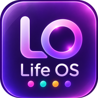

# Life OS

**Your whole life in one beautiful glass dashboard — routines, tasks, goals, money, and a daily diary.**

A free, installable, offline-first PWA with real-time sync across all your devices. No accounts, no ads, no tracking, no cost.

[Features](#-features) · [Live Demo & Install](#-install-it-on-your-phone) · [Self-hosting](#-host-your-own-free) · [Tech](#-how-its-built) · [Privacy](#-privacy)

---

## ✨ Features

**📅 Smart daily routine**
Habits organised into 3-hour time blocks through the day. Each habit runs on the weekdays *you* choose (gym Mon/Wed/Fri, late-night movies weekends only). Editing a schedule applies from today — your past record is never rewritten. Streaks skip days a habit wasn't scheduled, so a rest day never breaks your fire 🔥.

**📝 Day-wise tasks**
One-off tasks per day with one-tap *"→ Tomorrow"* to roll unfinished work forward. Browse any past day through a smooth zooming date carousel that previews yesterday and tomorrow at the sides.

**🎯 Measurable goals**
No vague checkboxes. Track goals the way they're actually measured: book pages read, money saved toward a purchase, distance/hours/sessions counted, or a simple percentage. Every update is timestamped and the progress bar moves itself.

**💰 Money, day by day**
Log every expense (amount + place + note) and every earning (amount + source). Daily totals, monthly reports with top spending places and income sources, and month-by-month history navigation.

**📔 Daily diary**
End each day with a few lines. Your entries build a private, dated life log — exportable as clean JSON, perfect if you ever want to feed your own history to an AI model.

**🎁 Reward system**
Every routine tick, finished task, diary entry, and completed goal earns points. Define your own rewards — *"eat out: 300 pts"* — and claim them when you've earned them.

**🏠 Bento home dashboard**
Completion ring, pending tasks, goal average, spend/earn summaries, reward balance, plus a full-month habit grid — all in a glassmorphism bento layout.

**🔒 Private by design**
Optional 4/6-digit PIN with fingerprint unlock on phones (laptops open directly). Automatic weekly backup to a JSON file, plus manual export and one-tap restore/import.

**🎨 Looks the way you want**
Liquid-glass UI over animated floating bubbles, dark & light modes, or set any photo from your gallery as the app background.

---

## 📲 Install it on your phone

Life OS is a PWA — it installs from the browser, no app store needed.

1. Open the app URL in Chrome / Samsung Internet on your phone.
2. Tap the **Install app** prompt (or browser menu → *Add to Home screen*).
3. It opens full-screen from its own icon and works offline.

**Sync across devices:** tap ⚙ → create a sync key on your first device, then enter the same key on any other device. That's it — no email, no password. Treat the key like a password; anyone who has it can access that data.

---

## 🚀 Host your own (free)

Everything runs on free tiers — $0 forever at personal scale.

1. **Fork/clone this repo.**
2. **Create a free [Firebase](https://console.firebase.google.com) project** → enable **Cloud Firestore** → paste the security rules from [`SETUP.md`](SETUP.md).
3. **Register a web app** in Firebase project settings and copy its config into the `firebaseConfig` block near the top of the `<script>` in `index.html`.
4. **Deploy on [Netlify](https://app.netlify.com)** (or GitHub Pages / Vercel / any static host): *Add new site → Import from Git → pick your repo.* No build command — it's a single static page.

Full step-by-step instructions: [`SETUP.md`](SETUP.md).

---

## 🛠 How it's built

| | |
|---|---|
| **Stack** | Single-file vanilla HTML/CSS/JS — zero frameworks, zero build step |
| **Storage** | `localStorage` (offline-first) + Cloud Firestore (real-time sync) |
| **Sync model** | Private sync key → SHA-256 hash → one Firestore document; no auth server needed |
| **Offline** | Service worker cache — works with no internet after first load |
| **Security** | PIN hashed with SHA-256 (device-only), WebAuthn platform biometrics |
| **UI** | Hand-rolled glassmorphism, CSS-animated background, pointer-events drag & drop |

The entire app is one `index.html` (~2,000 lines). Read it top to bottom in one sitting.

---

## 🔐 Privacy

- No analytics, no trackers, no ads, no third-party scripts except Firebase.
- Your data lives in **your own** Firebase project — nobody else's server.
- PIN and biometric credentials never leave your device.
- Export everything as JSON any time; delete your Firebase project and the data is gone for good.

---

## 🗺 Roadmap

- Weekly review summaries & trend charts
- Mood tracking linked to diary entries
- Budgets per spending category
- Native Android shell (home-screen widget + Samsung Health)

---

## 🤝 Contributing

Issues and PRs welcome. Keep the spirit: one file, no frameworks, free to run.

## 📄 License

[MIT](LICENSE) — do whatever you like, a star ⭐ is always appreciated.
